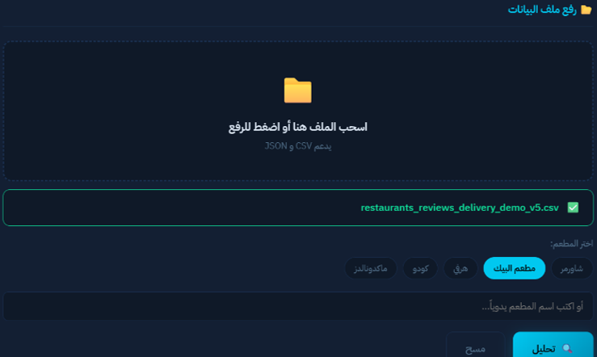
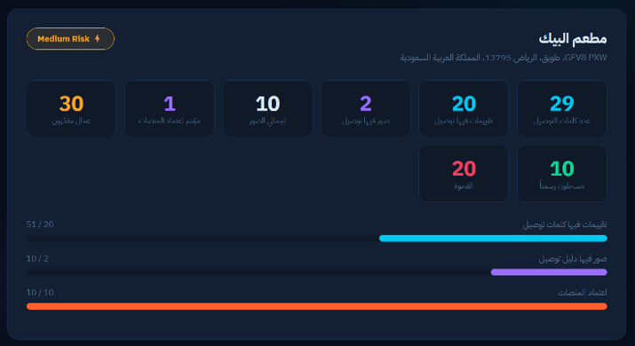
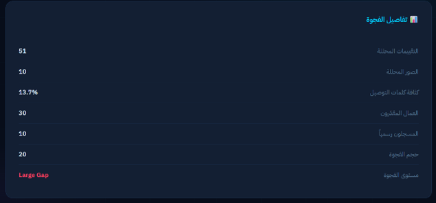
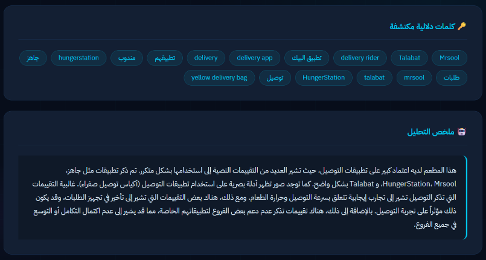
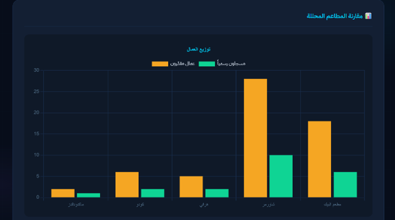
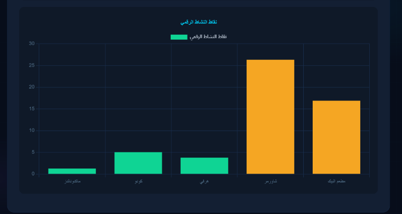
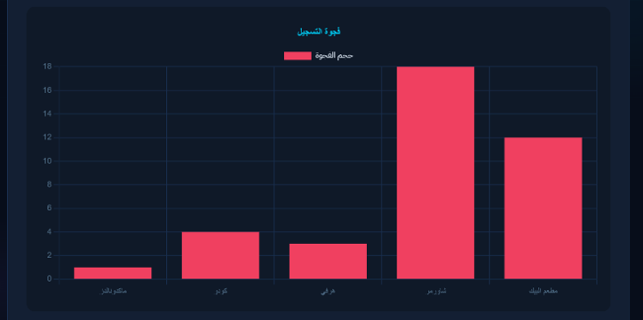
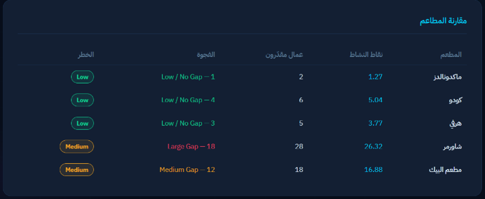
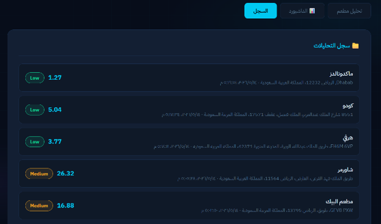

# rasd-platform-dependency-analysis

Rasd is a Flask-based web application that analyzes restaurant datasets to estimate their dependency on digital food delivery platforms. The system processes uploaded datasets, analyzes customer reviews and restaurant images, generates business indicators, and presents the results through an interactive dashboard.

---

## Problem Statement

Analyzing restaurant dependency on food delivery platforms is difficult because valuable insights are scattered across large datasets of customer reviews and images. Manual analysis is time-consuming and inefficient, making it challenging to generate reliable business insights.

---

## Features

* Upload restaurant datasets in CSV and JSON formats.
* Automatic data cleaning and preprocessing.
* Detect delivery-related keywords from customer reviews.
* Analyze restaurant images using the Google Gemini API.
* Generate business indicators:

  * Digital Activity Score
  * Platform Dependency Index
  * Estimated Gig Workers
  * Registered Workers
  * Activity Gap
  * Risk Level
* Compare analysis results across restaurants.
* Interactive dashboard with charts and summary tables.

---

## Technologies Used

* Python
* Flask
* HTML
* Chart.js
* Google Gemini API
* Apify
* SerpApi

---

## Screenshots

## Screenshots

### 1.Dataset Upload and Restaurant Selection

### 2.Dashboard Overview

### 3.Data Cleaning Report

### 4.Activity Gap Details

### 5.Analysis Summary

### 6.Estimated vs Registered Workers Comparison

### 7.Digital Activity Score Comparison

### 8.Registration Gap Comparison

### 9.Restaurants Comparison Table

### 10.Analysis History

---

## Dataset

A demonstration dataset is included in this repository for testing and showcasing the application's functionality.

---

## Note

The Google Gemini API key is intentionally omitted from this repository. Replace the placeholder with your own API key before running the application.
